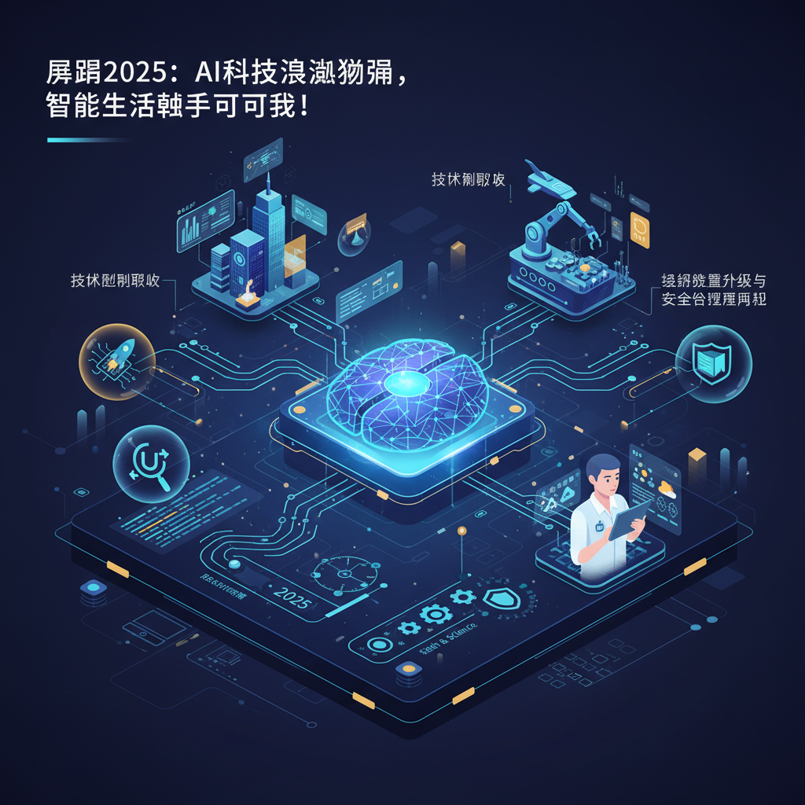

+++
title = "### 2025: AI Transforms Work & Life"
linkTitle = "AI正在改变我们的工作和生活"
weight =2
date = 2025-12-30
+++

### 2025: AI Transforms Work & Life

## 展望2025：AI科技浪潮汹涌，智能生活触手可及！

人工智能（AI）的进化速度超乎想象，2025年被视为AI发展史上的一个里程碑。它将不再仅仅是辅助工具，而是深度融入我们工作与生活的方方面面，开启通用人工智能的新篇章。让我们一探究竟，未来一年AI将带来哪些颠覆性变革？

### 技术模型突破，迈向更高级智能

2025年，AI模型的能力将显著增强，尤其在推理层面，能够解决科学、编程、数学、法律、医学等复杂领域的难题，执行多步骤任务。微软的Phi和Orca系列小模型，通过高效的数据管理和合成数据训练，已展现出超越传统大模型的专业能力。

未来的AI将走向**统一多模态大模型**，原生打通视觉、听觉、3D等多种数据模态，更高效地模拟人类思维。此外，注重“因果”推理的**世界模型**将加速发布，赋予AI更高级的认知、逻辑推理和决策能力，为自动驾驶、机器人和智能制造等领域带来深远影响。

尽管“规模化法则”（Scaling Law）的增速放缓，但其核心理念将以新的形式延续，例如通过自监督学习优化数据处理、智能算法探索高效模型设计。同时，**推理计算**将提升大模型准确率，**合成数据**则因高质量数据稀缺而价值凸显。

### 应用场景爆发，重塑产业与生活

2025年，AI将全面渗透，带来一场深刻的产业与生活变革：

- **智能代理普及**：新一代AI智能代理将能处理筛选邮件、会议记录、人力资源管理甚至供应链中断处理等多种任务，彻底改变工作模式。
- **具身智能量产元年**：具身智能持续突破，人形机器人有望进入量产阶段，并在工业场景中发挥更大作用。
- **AI for Science (AI4S)**：大模型引领的AI4S将成为科学研究范式变革的关键，赋能生物医学、气象、材料发现等前沿领域。
- **“人工智能+”全面铺开**：AI将快速融入各类产品、服务和工作流程，“产业+AI”模式将广泛落地。
- **端侧AI创新涌现**：AI正在重塑端侧设备的新分工和格局，创新层出不穷。
- **自动驾驶迈向端到端**：自动驾驶技术将向端到端发展，Robotaxi有望进入商业化落地阶段。

### 基础设施升级与安全治理并行

全球各国对AI技术体系的重视程度空前，对**AI基础设施和主权AI**的持续投入将重塑全球科技竞争格局。然而，AI的快速发展也带来了对**能源需求的大幅增长**，可持续发展刻不容缓。

在**AI安全与治理**方面，全球已形成广泛共识。各国正加快完善治理体系，例如欧盟通过了《人工智能法案》，美国则强调循序渐进的协同治理，以应对AI带来的潜在风险。

### 巨头云集，产品动态亮点频出

科技巨头和创新企业在AI领域的动作频繁：

- **谷歌**：已于12月17日推出最新人工智能模型Gemini 3 Flash。
- **Mozilla**：任命新CEO并推出“AI-first”战略，计划将AI模型嵌入Firefox核心功能，如摘要、改写和搜索助手。
- **Bilibili**：2025年跨年晚会宣布与千问APP合作，深度融合AI创作能力，提升互动体验。
- **华为**：明年将在韩国推出昇腾AI芯片。
- **联想**：将举办天禧AI生态伙伴大会，并可能推出AI智能体。
- **英伟达**：H200芯片预计明年2月中交付，首批达数万颗。
- **智谱**：开源GLM-4.7大模型，编程与推理能力显著提升。
- **OpenAI**：正在招募新的安全主管，以应对日益增长的工作压力。

2025年，AI的飞跃将体现在技术、应用、治理等多个维度，它正从辅助工具全面转型为我们工作与生活中不可或缺的伙伴。一个更加智能、高效的未来，正加速到来！