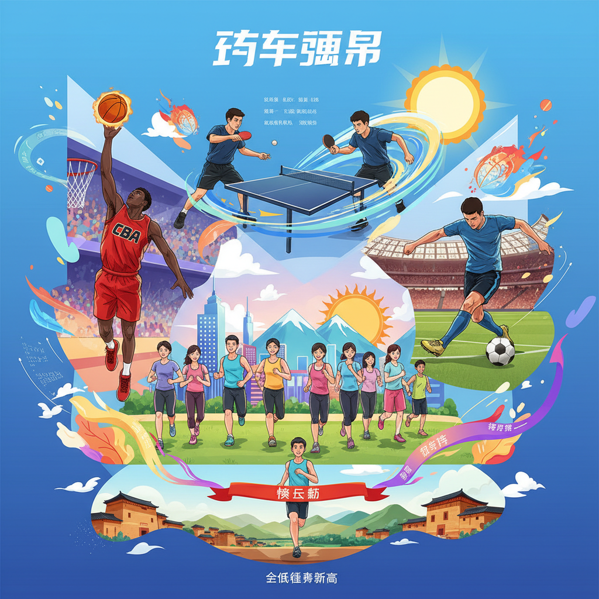

+++
title = "体坛周报：全民健身创新高，CBA欧陆战火燃！"
linkTitle = "全民健身创新高，CBA欧陆战火燃！"
weight =2
date = 2025-12-30
+++

## Sports

### 体坛周报：全民健身创新高，CBA欧陆战火燃！

体育周报：全民健身新高，CBA激战正酣，欧陆足坛风云变幻！

近期体坛可谓精彩纷呈，从国民体质的喜人提升，到CBA联赛的激烈角逐，再到NBA的群雄逐鹿和欧洲足坛的经典对决，每一条新闻都牵动着体育迷的心弦。

### 国内体育亮点：健康中国与竞技突破

首先传来振奋人心的消息：中国全民健身事业再上新台阶。经常参加体育锻炼的人数比例已达38.52%，国民体质合格率高达84.9%，优良率也创历史新高，显示出健康中国战略的显著成效。在竞技层面，2025年中国体育健儿共斩获146个世界冠军，彰显了强大的体育实力。

中国足球方面，足协新设立了纪律与道德委员会，力图加强行业规范，而外界普遍认为，青训仍是中国足球未来突破的关键。篮球CBA联赛战况胶着，北京队与广东队齐头并进，近期均取得三胜。CBA常规赛第八轮，北控主场不敌上海队20分，而广东队则在第七轮豪取七连胜，山西队末节反扑未果，也展现了联赛的激烈与多变。

### 国际与综合赛事：冰雪运动与乒乓盛宴

2025乒超联赛总决赛落下帷幕，深圳大学队和山东魏桥队分别加冕女团和男团冠军，王曼昱、蒯曼的再次交锋以及王楚钦“不留遗憾”的决心，都为比赛增添了看点。

马拉松热潮席卷全国，莆田、黄埔、漳州·华安土楼、惠州等多地马拉松赛事成功举办，数万跑者用脚步丈量美丽山河。此外，羽超联赛常规赛收官，总决赛四强尘埃落定；慢投垒球、贵州山水越野挑战赛总决赛也相继落幕。冬季运动更是热闹非凡，上合雪地足球赛、雪地足球村超联赛、全国雪地腰旗橄榄球公开赛、冰上龙舟超级联赛接连开赛，北京TOP游泳国际公开赛和镜泊湖冬泳挑战赛也吸引了众多爱好者参与，展现了中国体育的多元魅力。

### NBA赛场：群星闪耀，胜负难料

NBA战火不止，开拓者队险胜凯尔特人队，成功止住连败颓势。灰熊队则迎来莫兰特复出，他贡献两双，加上杰克逊的24分5封盖，助球队大胜雄鹿队。凯尔特人队普里查德砍下29分9助攻，客场大胜步行者。太阳队凭借布克30分9助攻的发挥，击败鹈鹕队。黄蜂队鲍尔贡献22分，布莱克也有24分入账，帮助球队战胜魔术队，每一场比赛都充满了悬念和精彩。

### 国际足球联赛：意甲英超，豪门争锋

欧洲足坛同样不平静。意甲赛场，罗马3比1轻取热那亚，AC米兰3比0完胜维罗纳，暂居榜首，尤文图斯2比0击败比萨升至第三，佛罗伦萨5比1大胜乌迪内，格局初显。

英超方面，水晶宫0比1不敌托特纳姆热刺，阿森纳2比1力克布莱顿。最引人瞩目的当属阿斯顿维拉，沃特金斯替补双响逆转蓝狮，帮助球队豪取11连胜，追平了队史111年纪录，成为了本轮英超的最大黑马。

无论是国内的全民健身成果，还是国际赛场上的激烈对抗，体育的魅力无处不在。让我们继续关注，期待更多精彩瞬间！