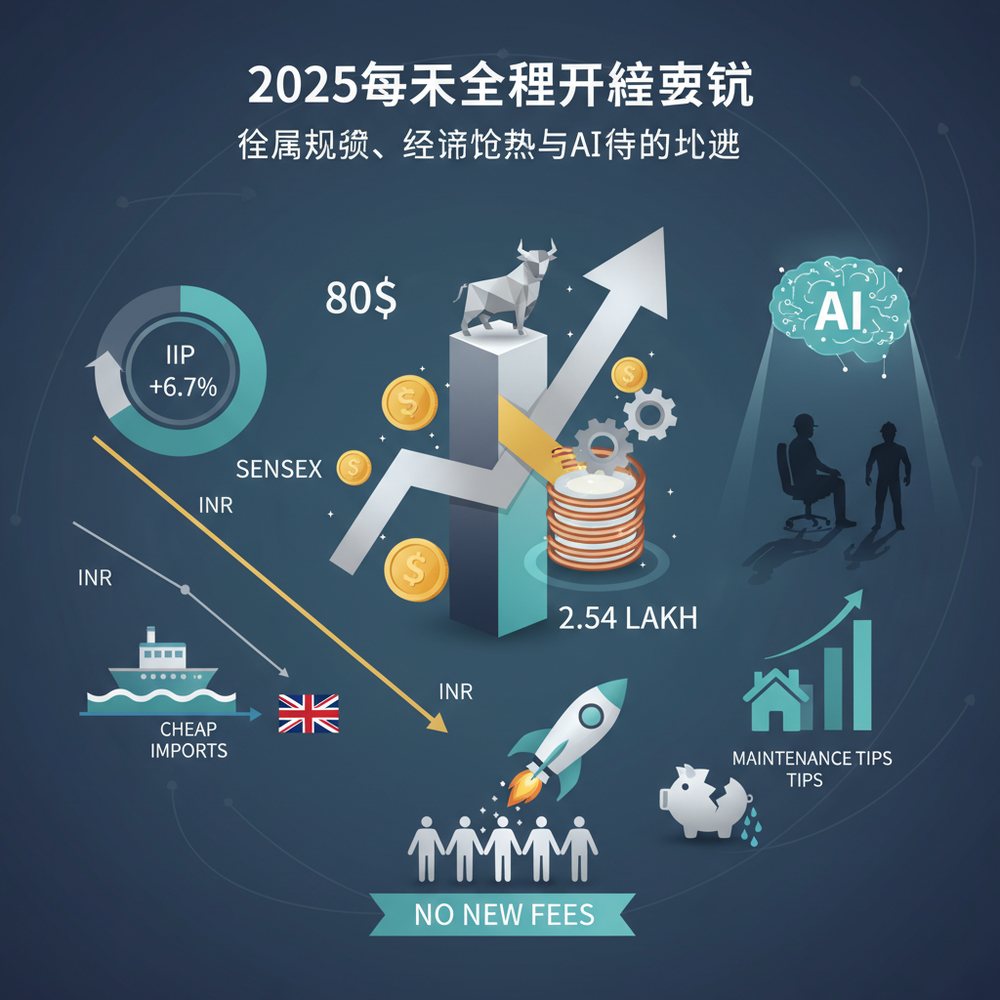

+++
title = "白银和铜价飙升寓意何为"
linkTitle = "白银和铜价"
weight =10
date = 2025-12-29
+++

2025年年末，全球金融市场风起云涌，从大宗商品的屡创新高到各国经济指标的波动，再到科技进步对社会结构的影响，一系列事件共同绘制了一幅复杂而生动的全球财经图景。

### 一、全球市场与大宗商品：白银与铜价势如破竹

近期，白银和铜价的表现尤为抢眼。白银期货价格在印度飙升至创纪录的每公斤2.54万卢比，全球市场价格更是突破每盎司80美元。据报道，埃隆·马斯克已就白银价格创纪录可能带来的影响发出警告，而中国对白银出口的限制也加剧了市场的紧张情绪。2025年，白银ETF获得了巨额收益。与此同时，铜价也因全球供应短缺的担忧，正迎来15年来最大涨幅，达到历史新高。这股金属狂潮反映了市场对工业需求增长的乐观预期，以及对未来供应的担忧。

### 二、经济指标与趋势：印度喜忧参半，全球挑战并存

印度的经济数据呈现出喜忧参半的局面。2025年11月，印度工业生产指数（IIP）增长率跃升至6.7%，创下25个月以来的新高，这主要得益于制造业的强劲复苏。然而，股市表现却不尽如人意，印度SENSEX指数连续第四个交易日下跌346点，主要原因在于外国资金流出和年末清淡的交易。印度卢比兑美元汇率也出现波动，近期下跌8派士，收于89.98。

放眼全球，经济学家指出，廉价的中国进口商品可能有助于降低英国的通货膨胀率。而在美国，近半数民众认为他们的财务安全状况正在恶化，这反映出普通家庭在面对通胀和经济不确定性时的压力。欧洲也面临养老金挑战，其社会契约的可持续性正受到严峻考验。

### 三、企业动态与行业聚焦：AI影响深远，IPO市场活跃

人工智能（AI）的影响正日益渗透到各行各业。有讨论认为，AI将对年轻的办公室职员构成就业挑战，但也可能对建筑行业产生积极影响。为了应对AI作弊的担忧，英国会计机构计划停止远程考试。在企业新闻方面，前威塞克斯水务（Wessex Water）首席执行官被曝在绩效工资禁令下仍获得了17万英镑奖金，引发争议。另一方面，功勋卓著的IBM转型功臣路易斯·格斯特纳（Louis Gerstner）不幸逝世。

印度的首次公开募股（IPO）市场预计在2026年将异常活跃，报告预测一级市场有望筹集4万亿卢比的资金。此外，Akum Pharma的财务主管Rajkumar Bafna因德里污染问题辞职，显示了环境问题对企业运营和人才流动的影响。伦敦证券交易所（LSE）也迎来了非洲开发银行集团及其他几家公司的上市。

### 四、消费者与个人理财：生活成本与新规下的应对

与消费者息息相关的消息也不少。由于区域机场面临更高的税费，航空旅客被警告机票价格将上涨。专家提供了关于家庭维护的实用技巧，旨在帮助人们避免意外账单，从水壶故障到屋顶漏水，提醒人们未雨绸缪。在英国，音乐会观众正在联合起来抵制新一轮的票务附加费用，争取自身权益。

**总结**

2025年年末的全球财经格局充满了变数与机遇。大宗商品的强劲势头预示着工业经济的活力，而各国经济的内部挑战和全球性的结构性问题则提醒我们保持警惕。AI技术的发展在带来效率提升的同时，也带来了新的社会和伦理考量。对于普通投资者和消费者而言，理解这些趋势，并根据自身情况调整财务策略，显得尤为重要。在这个快速变化的时代，持续学习和适应是把握未来的关键。