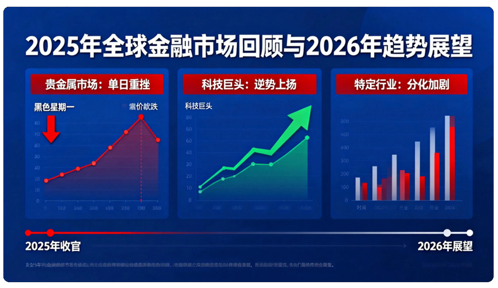

+++
title = "2025年终回顾：掘金2026市场新机遇"
linkTitle = "掘金2026市场新机遇"
weight =11
date = 2025-12-30
+++

### 2025年终回顾：掘金2026市场新机遇

## 市场风云变幻：2025年终回顾与2026展望

近期全球金融市场波澜壮阔，贵金属上演“黑色星期一”，而科技巨头和特定行业则展现出截然不同的发展轨迹。2025年即将收官，让我们一起回顾这些重要时刻，并展望未来一年的趋势。

### 全球经济脉动与股市表现

2025年美国股市表现抢眼，标普500指数创下历史新高。尽管周一美股三大股指小幅收跌，但交易员们普遍为这个丰收年画上句号。华尔街分析师对美股未来走势普遍看好。同时，衡量美国国债市场波动性的指标预计将创下2009年以来最大年度降幅，显示市场趋于稳定。

在全球范围内，资金正积极回流东盟股市，预计2026年将成为该区域的焦点。日本方面，政府提出了创纪录的预算支出，同时有效控制了新增债务。中国经济数据喜人，11月制造业产值连续第三个月增长，同比增长14.3%，核心通胀率同比维持在1.2%的水平，显示经济稳健复苏。此外，中柬泰三国高层近期在云南举行了抚仙会晤，加强区域合作。

### 贵金属市场的“黑色星期一”

在经历黄金、白银和铂金价格此前创新高的辉煌后，贵金属市场遭遇了突如其来的“黑色星期一”。现货黄金大跌超4%，白银暴跌超9%，钯金更是狂泻超15%。此次大跌的导火索是芝商所宣布上调多种金属合约保证金，叠加交易员获利了结，共同加剧了价格的下跌势头。然而，瑞银仍对黄金前景乐观，已将2026年黄金目标价上调至最高5400美元，理由是全球政治及金融风险犹存。

### 公司与行业：几家欢喜几家愁

在公司层面，美股车市中通用汽车（GM.US）领跑2025年，股价飙升55%创下纪录。谷歌母公司Alphabet（GOOG.US, GOOGL.US）打赢“翻身仗”，股价涨幅位居“七巨头”之首。相比之下，亚马逊（AMZN.US）在2025年表现不及其他“七巨头”，股价仅上涨6%，但华尔街对其2026年表现持乐观态度。

国内方面，百度（HK:89888）股价劲升7%，其AI营销策略将在2026年转向“全局经营”。中芯国际（00981）高开近3%，计划斥资约406.01亿元收购中芯北方49%股权，进一步整合业务。然而，潮流玩具巨头泡泡玛特股价累计下跌40%，Labubu二手价格腰斩，市值蒸发2000亿，显示市场对盲盒经济的重新评估。优必选（09880）股价续涨超3%，创始人周剑再次发出禁售承诺，彰显对公司未来发展的信心。

加密货币领域，巨鲸MicroStrategy（MSTR.US）再次出手，斥资1.09亿美元加仓比特币。科技股方面，美光科技（MU.US）周一逆市上涨3.4%，股价触及历史新高。有传闻称字节跳动将以400亿人民币采购华为芯片，预示着科技巨头间的深度合作。

### 其他重要新闻一览

万亿商业航天产业迎来新的期待，中国伽利略卫星导航有限公司董事长刘曙光指出，该行业内卷严重，需“走出去”寻求国际订单和规模效应。地缘政治方面，东部战区在演习第二天组织了重要的军事演习和实弹射击。美国政坛，特朗普总统暗示他已对下一任美联储主席人选有非常偏好，并表示仍可能解雇现任主席鲍威尔，为美联储政策走向增添变数。

此外，我国将自2026年1月1日起调整部分商品关税税率和税目，这无疑将对相关进出口企业产生影响。日本东京12月核心物价指数同比上升2.3%，高于日本央行目标，或将对其货币政策产生压力。最后，一年一度的CES科技展即将举行，英伟达CEO黄仁勋和AMD CEO苏姿丰将同日亮相，机器人混战一触即发，预示着人工智能和机器人技术将是未来科技发展的重点。

整体来看，2025年全球市场在强劲增长与剧烈波动中交织前行。展望2026年，宏观经济的稳定性、地缘政治的演变以及科技创新的突破，都将是投资者和市场参与者需要密切关注的关键因素。