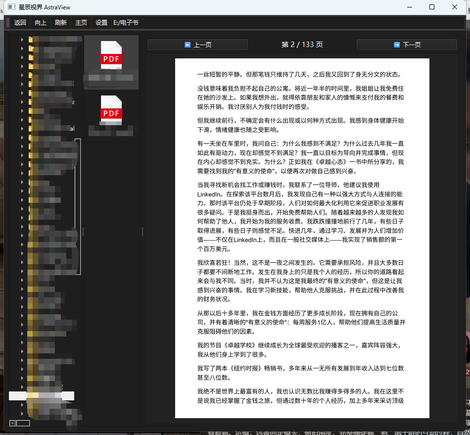

+++
title = "星辰视界-AstraView"
linkTitle = "creator-perspective"
weight =100
date = 2026-04-07
+++
## 面向内容创作者 / 自媒体：用 AstraView（星辰视界）把素材库变成“内容灵感池”

如果你是 YouTuber、B 站 UP 主、博主、短视频创作者，你的电脑里一定堆满了各种各样的素材：

- 拍摄视频原片、剪辑输出、背景音乐、音效、转场包；
- 封面 PSD / PNG、缩略图、Logo 源文件；
- 脚本文档、提纲 Markdown、合作方提供的 PDF 简报。

问题在于：**你可能已经记不住每个文件到底是什么内容了。**

### 你的素材库，需要一个“所见即所得”的浏览器

AstraView（星辰视界）可以帮你把这堆看似杂乱的文件，变成一个**可视化素材库**：

- 视频文件（MP4、MKV、AVI、MOV）：点击即播放，画面自适应窗口，快速确认内容；
- 音频文件（MP3、WAV、FLAC 等）：不仅能播放，还会显示**动态波形图**，方便你快速找到情绪/节奏变化明显的片段；
- 图片 & 封面稿（JPG、PNG、WebP、PSD）：瞬间预览，配合滚轮缩放与拖拽，方便你检查细节；
- 文档脚本（PDF、Word、Markdown）：在同一界面中直接阅读，无需额外打开阅读器或编辑器。

当你准备一个新视频时，只需要打开放素材的目录，用 AstraView（星辰视界）按顺序浏览一遍——你会惊讶地发现：**很多“被你忘掉的好素材”其实一直就在那里。**

### 用 AstraView（星辰视界）建立属于自己的“项目空间”

AstraView（星辰视界）的三栏布局非常适合内容创作者用“项目思维”来管理文件：

- 左栏：按内容类型 / 系列搭建文件夹，比如：
  - `YouTube\AstraView_Review\raw\`
  - `YouTube\AstraView_Review\covers\`
  - `YouTube\AstraView_Review\script\`
- 中栏：按时间 / 文件名排序素材；
- 右栏：即时预览具体内容。

它不像剪辑软件那样厚重，但是足够强大，帮你完成“浏览 & 筛选”这一步，把真正剪辑的时间留给 PR / DaVinci。

### 更高效地选封面、选 BGM、选素材

- **选封面**：在一个目录中放几十张候选封面图（PNG / PSD），用方向键快速切换文件，右侧即时预览，几分钟就能决定哪一张最适合；
- **选 BGM**：把常用 BGM 放在一个文件夹，通过波形可视化快速找到高潮 / 安静片段，用耳朵和眼睛一起做决定；
- **选插画 / Cutaway**：对着图像预览滑动滚轮，检查画面信息量和构图是否适合作为插画背景。

对于自媒体来说，**选素材的速度，直接决定了你的产出频率**。AstraView（星辰视界）能帮你把这一步大幅提速。

